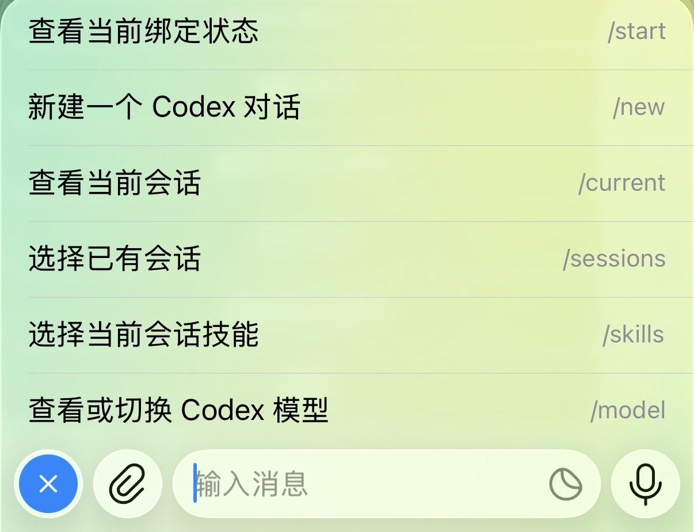
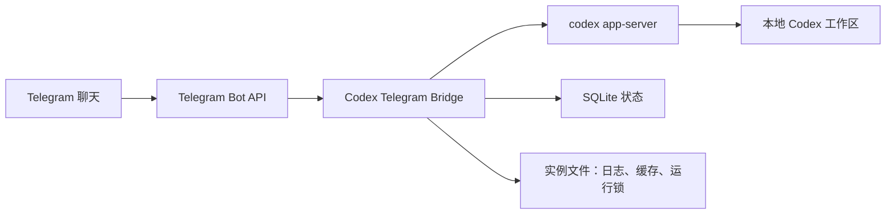

# Codex Telegram Bridge


[](https://github.com/zev8/codex-telegram-bridge/stargazers)

我写这个东西的原因很简单：有时候人不在电脑前，但就是想继续用那台电脑上的 Codex。远程桌面太重，手机上重新搭一套又很别扭，所以干脆把 Telegram 接到本机 `codex app-server` 上。

现在你给 bot 发一句话，它会交给本机 Codex；Codex 要跑命令、改文件、让你确认选项，Telegram 里也能直接处理。适合放在 Mac、家里主机、办公室电脑上常驻跑。

English: use Telegram as a remote control for your local Codex app-server.

如果这个项目刚好解决了你的痛点，欢迎顺手点个 Star。这个项目会继续往“手机上也能认真用 Codex”的方向做。

## 开箱即用

准备好三样东西就能跑：

- 一个 Telegram bot token
- 你的 Telegram user id，用来做白名单
- 一台已经能正常运行 `codex app-server` 的机器

最短流程不是自己一条条敲命令，而是把这个仓库地址发给 Codex，让 Codex 帮你开始：

```text
请帮我安装并启动这个 Codex Telegram Bridge：

https://github.com/zev8/codex-telegram-bridge

我的 Telegram bot token 是：replace_me
我的 Telegram user id 是：123456789
默认工作区是：/absolute/path/to/workspace
```

Codex 会帮你拉取仓库、安装依赖、复制配置模板、填写实例配置、运行自检，然后启动桥接服务。

如果你不想把 token 直接发在对话里，也可以这样说：

```text
请帮我安装这个仓库，并创建配置文件；token 和 user id 我稍后自己填。
```

最后去 Telegram 给你的 bot 发 `/start`。如果一切正常，你就可以在手机上直接和本机 Codex 对话了。想自己手动跑的话，下面也保留了详细启动步骤。

## Telegram 菜单功能

启动后，bot 会自动注册这些菜单命令：



| 菜单 | 能做什么 |
| --- | --- |
| `/start` | 第一次进来先用它。私聊里会自动创建或恢复当前 Codex 会话，也会告诉你当前绑定的是哪个线程。 |
| `/new` | 新开一个 Codex 线程。适合换任务、换项目、或者不想污染当前上下文时使用。 |
| `/current` | 查看当前聊天绑定的 Codex 会话、线程 ID，以及这个线程已经选择了哪些技能。 |
| `/sessions` | 浏览当前工作区下已有的 Codex 会话，用 Telegram 按钮切换。群组里通常先用这个绑定一个会话。 |
| `/skills` | 给当前 Codex 线程选择技能、取消技能或清空技能。选择结果会跟着线程保存，不会因为换聊天丢掉。 |
| `/model` | 查看当前 Codex 模型，也可以用按钮切换模型；如果当前回合正在跑，新模型会从下一轮开始生效。 |

普通消息不用命令，直接发文本就行。当前 Codex 回合还在跑的时候，你继续发新消息，桥接会尝试把它追加到同一个回合里。

图片也可以直接发：普通照片、图片文件都支持；caption 会和图片一起交给 Codex。Codex 生成或查看到的本地图片，也会尽量回传到 Telegram。

## 功能说明

- 私聊、群组、超级群都能用，一个 Telegram 聊天可以绑定一个 Codex 线程。
- 只允许白名单用户操作 bot，其他人私聊会收到 `This bot is private.`。
- 使用本机 `codex app-server`，不是另起一套简化版聊天接口。
- 支持命令执行审批、文件修改审批，以及基础的用户输入选择。
- 支持 Codex 技能选择，并且技能选择按线程保存。
- 使用 SQLite 保存聊天绑定、线程技能、Telegram update offset 和待处理审批。
- Telegram 下载的图片、数据库、日志、运行锁都放在实例目录，不放进仓库。
- 提供 `doctor` 自检、代理配置、模型 fallback 和 macOS `launchd` 常驻脚本。

## 架构



## 仓库与实例

这个仓库只保存桥接服务本体。你的私有 bot 配置和运行数据应该放在仓库外。

推荐实例目录结构：

```text
~/.codex-telegram-bridge/
  instances/
    default/
      config.env
      data/
        bridge.db
        tg-files/
      logs/
      run/
```

这样可以：

- 安全发布和同步源码
- 在同一份代码上维护多个 bot 实例
- 避免提交 bot token、个人路径、数据库、缓存文件和日志

## 项目结构

| 路径 | 说明 |
| --- | --- |
| `src/index.ts` | 主入口和进程锁 |
| `src/bridge-service.ts` | Telegram 与 Codex 的核心编排逻辑 |
| `src/codex-app-server.ts` | 本地 `codex app-server` JSON-RPC 客户端 |
| `src/telegram.ts` | Telegram Bot API 客户端 |
| `src/config.ts` | 外部实例配置和路径解析 |
| `src/db.ts` | SQLite 持久化 |
| `src/session-index.ts` | Codex 桌面端会话索引集成 |
| `src/progress-message.ts` | Telegram 进度消息渲染 |
| `src/healthcheck*.ts` | Codex、Telegram 和完整 doctor 自检 |
| `src/generated/` | 生成的 Codex app-server 协议类型 |
| `config.env.example` | 实例配置模板 |
| `launchd/` | macOS 常驻服务脚本 |

## 运行要求

- Node.js 24+
- 本机已安装 Codex，并且 `codex app-server` 可用
- 本机 Codex 已登录，或在实例配置中提供 `OPENAI_API_KEY`
- 已通过 BotFather 创建 Telegram bot token
- 当前机器可以访问 Telegram Bot API，或已配置代理 / Bot API 网关

## 详细启动步骤

安装依赖：

```bash
npm install
```

编译项目：

```bash
npm run build
```

创建外部实例目录：

```bash
mkdir -p ~/.codex-telegram-bridge/instances/default
```

复制配置模板：

```bash
cp ./config.env.example ~/.codex-telegram-bridge/instances/default/config.env
```

编辑 `~/.codex-telegram-bridge/instances/default/config.env`：

```env
TELEGRAM_BOT_TOKEN=replace_me
TELEGRAM_ALLOWED_USER_ID=123456789
CODEX_WORKSPACE_CWD=/absolute/path/to/workspace
```

检查 Codex 侧：

```bash
npm run doctor:codex -- --instance default
```

检查 Telegram 连通性：

```bash
npm run doctor:telegram -- --instance default
```

运行完整自检：

```bash
npm run doctor -- --instance default
```

启动桥接服务：

```bash
npm start -- --instance default
```

也可以显式指定配置文件：

```bash
npm start -- --config ~/.codex-telegram-bridge/instances/default/config.env
```

## 群组使用

- 可以把 bot 加入多个群组或超级群，每个聊天绑定不同 Codex 线程。
- 新群组里建议先发送 `/sessions` 选择已有线程，或发送 `/new` 新建线程。
- bot 只接受白名单 Telegram 用户操作。
- 如果要让 bot 接收群里的普通文本和图片消息，需要在 BotFather 中关闭 privacy mode。

## 配置说明

桥接服务按以下顺序查找配置：

1. `--config /path/to/config.env`
2. `CONFIG_FILE=/path/to/config.env`
3. `--instance <name>`
4. `INSTANCE_NAME=<name>`
5. `~/.codex-telegram-bridge/instances/default/config.env`
6. 当前目录下的 `config.env` 或旧版 `.env`

配置值优先级：

1. 当前进程环境变量
2. 外部 `config.env`
3. 程序默认值

常用配置项：

| 变量 | 说明 |
| --- | --- |
| `INSTANCE_NAME` | 实例名称，默认 `default` |
| `INSTANCE_ROOT` | 实例根目录 |
| `TELEGRAM_BOT_TOKEN` | Telegram bot token |
| `TELEGRAM_ALLOWED_USER_ID` | 允许操作 bot 的 Telegram 用户 ID |
| `CODEX_WORKSPACE_CWD` | 当前实例默认绑定的工作目录 |
| `CODEX_BIN` | Codex 可执行文件，默认 `codex` |
| `CODEX_MODEL` | 可选模型覆盖，例如 `gpt-5.4` |
| `CODEX_MODEL_CANDIDATES` | 可选模型 fallback 列表，用逗号分隔 |
| `OPENAI_API_KEY` | 本机 Codex 未登录时的备用认证 |
| `TELEGRAM_PROXY_URL` | Telegram 访问代理 |
| `TELEGRAM_API_BASE_URL` | 自定义 Telegram Bot API 网关 |
| `DATABASE_PATH` | SQLite 数据库路径 |
| `TELEGRAM_FILE_DIR` | Telegram 文件缓存目录 |
| `LOG_DIR` | 日志目录 |
| `RUN_DIR` | 运行文件和锁文件目录 |

## 网络说明

如果当前机器不能直连 Telegram，可以配置代理：

```env
TELEGRAM_PROXY_URL=http://127.0.0.1:7890
```

如果使用自建或转发的 Bot API 网关：

```env
TELEGRAM_API_BASE_URL=https://your-gateway.example.com
```

## 常驻运行

先编译：

```bash
npm run build
```

安装默认 macOS `launchd` 服务：

```bash
./launchd/install.sh --instance default
```

或显式指定配置文件：

```bash
./launchd/install.sh --config ~/.codex-telegram-bridge/instances/default/config.env
```

卸载服务：

```bash
./launchd/uninstall.sh --instance default
```

默认日志路径：

```text
~/.codex-telegram-bridge/instances/default/logs/bridge.stdout.log
~/.codex-telegram-bridge/instances/default/logs/bridge.stderr.log
```

## npm 脚本

| 脚本 | 说明 |
| --- | --- |
| `npm run dev -- --instance default` | 直接运行 TypeScript 源码 |
| `npm run build` | 编译到 `dist/` |
| `npm run check` | TypeScript 类型检查 |
| `npm run doctor:codex -- --instance default` | 检查本地 Codex 桥接是否可用 |
| `npm run doctor:telegram -- --instance default` | 检查 Telegram token 和连通性 |
| `npm run doctor -- --instance default` | 运行完整自检 |
| `npm run generate:protocol` | 重新生成 Codex app-server 协议类型 |

## 常见问题

### `Missing required configuration`

当前实例配置缺少必填项，或桥接服务没有找到预期的配置文件。

- 确认 `config.env` 存在。
- 启动时使用正确的 `--instance` 或 `--config`。
- 对照 `config.env.example` 补齐配置项。

### `Telegram bot OK` 超时

当前机器大概率无法访问 `api.telegram.org`。

- 添加 `TELEGRAM_PROXY_URL`。
- 或把 `TELEGRAM_API_BASE_URL` 指向自己的网关。

### `Codex is not authenticated`

桥接服务能启动 Codex，但本机 Codex 没有可用认证。

- 先在 Codex 桌面端或 CLI 完成登录。
- 或在实例配置中添加 `OPENAI_API_KEY`。

### `The model ... does not exist or you do not have access to it`

当前账号不可用所配置的 Codex 模型。

- 在实例配置中设置 `CODEX_MODEL=gpt-5.4`。
- 或修改 `~/.codex/config.toml` 中的模型配置。

### `This bot is private.`

当前 Telegram 账号不在白名单中。

- 检查实例配置里的 `TELEGRAM_ALLOWED_USER_ID`。

## 安全说明

- 不要提交 `.env`、`config.env`、数据库文件、Telegram 缓存文件、日志或运行文件。
- 尽量让 `TELEGRAM_ALLOWED_USER_ID` 保持最小范围。这个桥接服务可以通过 Codex 审批本机命令和文件操作。
- 推荐在私聊或可信群组中使用。
- 从 Telegram 接受命令执行或文件修改审批前，请认真检查内容。

## Star History

Star 徽章和走势图会在仓库公开后自动显示数据。

[](https://www.star-history.com/#zev8/codex-telegram-bridge&Date)

## Roadmap

- 更细粒度的多用户权限配置
- 面向服务器部署的 webhook 模式
- 更丰富的 Telegram 长文本渲染
- 更清晰的 active turn 和 pending approval 可观测性
- 可选 Docker 或 systemd 部署示例

## 贡献

欢迎提交 issue、想法和 pull request。这个项目尤其欢迎三类改进：

- 让远程操作更安全
- 提升 Codex 协议兼容性
- 改善 Telegram 使用体验

提交 PR 前建议先运行：

```bash
npm run check
```

## License

当前仓库还没有添加 license 文件。正式发布前建议补充开源许可证，让其他人可以在清晰条款下使用、fork 或贡献代码。
